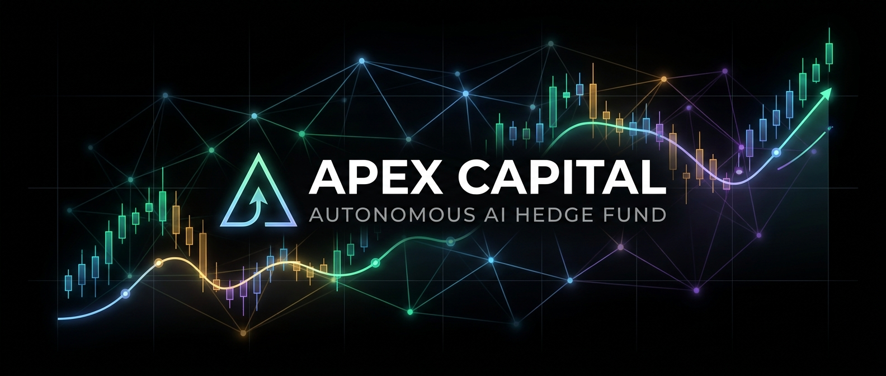
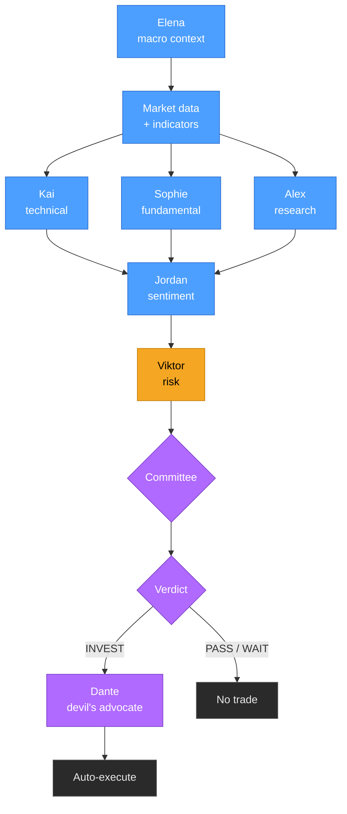
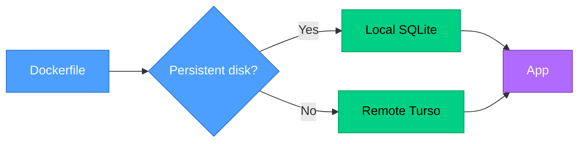

<div align="center">



<br><br>


<br>


</div>

<br>

A hierarchy of 10 AI agents with distinct personalities research stocks independently, debate,
and autonomously execute trades — no manual confirmation needed. Real market data, fake money,
so you can watch the strategy actually perform over time before ever risking real capital.

---

## The Team

| Agent | Role | Personality |
|---|---|---|
| **Elena** | Macro Economist | Calm, data-driven. Sets market regime for all other agents |
| **Kai** | Technical Analyst | Arrogant chart obsessive. "The tape never lies." |
| **Sophie** | Fundamental Analyst | Buffett/Munger devotee. Free cash flow above all |
| **Alex** | Research Analyst | Hyperactive. Finds what everyone else misses |
| **Jordan** | Social Sentiment | Reads Reddit + StockTwits. Never a perma-bull or bear |
| **Viktor** | Risk Manager | Seen every crash since 1987. Always says no first |
| **Leo** | Bull Advocate | Eternal optimist. Always finds a reason to buy |
| **Nina** | Bear Advocate | Permanent skeptic. Remembers 2008, 2001, 1987 |
| **Marcus** | CIO / Verdict | Ray Dalio energy. Final INVEST / PASS / WAIT decision |
| **Dante** | Devil's Advocate | Finds the fatal flaw after every INVEST verdict |

---

## How a Decision Gets Made

Every ticker — from a scheduled scan or a manual analyze click — runs through the same pipeline:



Inside the committee, **Leo** argues the bull case, **Nina** argues the bear case, and **Marcus**
hands down the final verdict.

> Not every trade came from this pipeline agreeing — if a scan finds nothing worth investing in,
> a guaranteed-trade fallback forces at least one trade per day using pure technical scoring, no
> LLM involved. Worth remembering when judging "how good are the AI's calls."

---

## Two Dashboards, One Bot

Same live data, same WebSocket feed — pick whichever you like.

<div align="center">

| `/` | `/clean` |
|:---:|:---:|
| Bloomberg-terminal dark, amber accents | Minimal black, light-blue accents |

</div>

---

<details>
<summary><b>Scheduled Jobs</b></summary>
<br>

All times CET, Mon–Fri:

| Time | Job |
|---|---|
| Every 1 min, 08:00–23:00 | Live price refresh, trailing stop, take-profit, dead-money exit |
| 08:00 | EU-open scan |
| 08:01 | Morning briefing |
| 13:45 | Deep pre-market scan — always fully analyzes top 10 |
| 15:30 | US-open scan |
| 17:30 / 19:30 | Intraday scans |
| 21:00 | Pre-close scan |
| 21:30 | Daily-minimum-trade enforcer |
| 1st Monday, 08:00 | Monthly report |

</details>

<details>
<summary><b>Tech Stack</b></summary>
<br>

- **Backend:** Python 3.11, FastAPI + uvicorn, fully async
- **LLM:** OpenRouter free models (9 rotated) → Gemini free tier as last-resort fallback
- **Market Data:** yfinance + pandas + `ta`
- **Web Search:** Tavily → DuckDuckGo fallback
- **Social Data:** PRAW (Reddit) + StockTwits REST API
- **Database:** SQLite (WAL mode), auto-switches to remote Turso if no persistent disk
- **Scheduling:** APScheduler
- **Frontend:** Vanilla JS, no build step, two interchangeable dashboard skins
- **Deploy:** Docker, runs on any Docker-friendly host

</details>

<details>
<summary><b>Local Setup</b></summary>
<br>

```bash
git clone https://github.com/Nikros07/Apex-Capital.git
cd Apex-Capital

cp .env.example .env
# edit .env — fill in your API keys, see table below

pip install -r requirements.txt
python main.py
# → http://localhost:8000
```

| Key | Required? | Source |
|---|---|---|
| `OPENROUTER_KEY_1..5` | Yes, at least 1 | [openrouter.ai](https://openrouter.ai) → Keys (free) |
| `GEMINI_API_KEY` | Recommended | [aistudio.google.com/apikey](https://aistudio.google.com/apikey) (free) |
| `TAVILY_API_KEY` | Optional | [app.tavily.com](https://app.tavily.com) — falls back to DuckDuckGo |
| `REDDIT_CLIENT_ID/SECRET` | Optional | [reddit.com/prefs/apps](https://reddit.com/prefs/apps) |

</details>

<details>
<summary><b>Deploy 24/7</b></summary>
<br>



**Railway** (recommended, ~5€/month) — connect the repo, Railway builds from the Dockerfile
automatically, add a Volume at `/data`, set `DB_PATH=/data/apex.db` plus your API keys.

**Docker Compose** (local / your own server):
```bash
docker compose up -d --build
```

**Render** (free, more moving parts) — no persistent disk on the free tier, so set
`TURSO_DATABASE_URL` + `TURSO_AUTH_TOKEN` (free, no card — see `.env.example`) and add an
external pinger (e.g. cron-job.org) hitting `/health` every ~10 min to stop it sleeping.

</details>

<details>
<summary><b>Risk Rules</b></summary>
<br>

- Position size = 1% account risk ÷ (1.5 × ATR)
- Stop-loss: entry − 1.5×ATR, trailing, only moves up
- Take-profit: partial (60%) at entry + 2.5×ATR, remainder trails to breakeven
- Max 15 positions, min 7% cash reserve
- Dead-money exit: held ≥48h with <1.5% gain → close, capital recycled into new opportunities
- Cash-blocked buy → auto-sells the weakest open position to free capital, then retries
- Viktor CRITICAL → CIO veto → forced PASS

</details>

<details>
<summary><b>Project Structure</b></summary>
<br>

```
apex/
├── main.py                     FastAPI app + WebSocket manager
├── agents/                     10 personas + LLM/search plumbing
├── core/                       Portfolio engine, scheduler, reports
├── data/                       Market/Reddit/StockTwits clients
├── utils/                      Key rotation, DB layer
├── static/
│   ├── index.html              Terminal UI (default, `/`)
│   └── dashboard-clean.html    Minimal UI (`/clean`)
├── Dockerfile / docker-compose.yml / railway.json / render.yaml
├── .env.example
└── requirements.txt
```

</details>

---

<div align="center">

`GET /health` for status · Built with [Claude Code](https://claude.com/claude-code)

</div>
