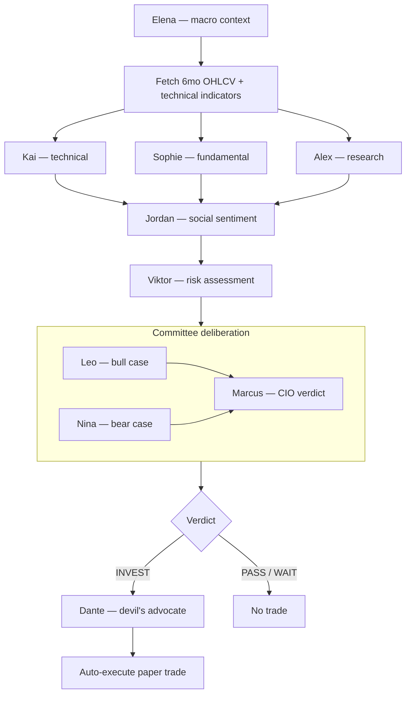

# ▲ Apex Capital Management

> Fully autonomous multi-agent AI hedge fund with simulated paper trading. Starts at €10,000.

A hierarchy of 10 AI agents with distinct personalities research stocks independently, debate,
and autonomously execute trades. No manual confirmation needed — the fund runs itself, 24/7,
with real market data and fake money, so you can watch how the strategy actually performs over
time before ever risking real capital.

---

## Agent Roster

| Agent | Role | Personality |
|---|---|---|
| **Elena** | Macro Economist | Calm, data-driven. Sets market regime for all other agents |
| **Kai** | Technical Analyst | Arrogant chart obsessive. "The tape never lies." |
| **Sophie** | Fundamental Analyst | Buffett/Munger devotee. Free cash flow above all |
| **Alex** | Research Analyst | Hyperactive. Finds what everyone else misses |
| **Jordan** | Social Sentiment | Reads Reddit + StockTwits. Never a perma-bull or bear |
| **Viktor** | Risk Manager | Seen every crash since 1987. Always says no first |
| **Leo** | Bull Advocate | Eternal optimist. Always finds a reason to buy |
| **Nina** | Bear Advocate | Permanent skeptic. Remembers 2008, 2001, 1987 |
| **Marcus** | CIO / Verdict | Ray Dalio energy. Final INVEST / PASS / WAIT decision |
| **Dante** | Devil's Advocate | Finds the fatal flaw after every INVEST verdict |

---

## Decision Pipeline

Every ticker that gets analyzed — whether from a scheduled scan or a manual `/api/analyze` call —
runs through this exact sequence (`agents/cio.py`):



**Important:** not every trade you'll see in the trade log came from this full pipeline agreeing.
If a scheduled scan finds no `INVEST` verdict anywhere in its candidates, a **guaranteed-trade
fallback** (`core/scheduler.py: run_forced_trade`) kicks in: it first retries the top-5
technically-scored tickers through the LLM pipeline, and if that *still* produces nothing, it
bypasses the LLM entirely and force-buys the highest-scored ticker using only the technical score
and ATR-based position sizing. This exists to guarantee at least one trade per trading day for
forward-testing purposes — worth keeping in mind when judging "how good are the AI's calls",
since some entries are pure rule-based fallbacks, not agent conviction.

---

## Scheduled Jobs

All times CET, Mon–Fri (`core/scheduler.py`):

| Time | Job | What it does |
|---|---|---|
| Every 1 min, 08:00–23:00 | Position monitor | Live price refresh, trailing stop, partial take-profit, dead-money exit, hard stop-loss |
| 08:00 | EU-open scan | Signal scan across the whole watchlist |
| 08:01 | Morning briefing | Broadcasts open positions, overnight P&L, key levels |
| 13:45 | Deep pre-market scan | Scores every ticker, **always** fully analyzes the top 10 before US open |
| 15:30 | US-open scan | Signal scan |
| 17:30 / 19:30 | Intraday scans | Lower volume threshold — catches unusual mid-session activity |
| 21:00 | Pre-close scan | Signal scan |
| 21:30 | Daily-minimum-trade enforcer | Forces a trade if none executed yet today |
| 1st Monday, 08:00 | Monthly report | P&L summary + Marcus's narrative |

Every scan additionally guarantees ≥1 trade via the fallback described above.

---

## Tech Stack

- **Backend:** Python 3.11, FastAPI + uvicorn (fully async)
- **LLM:** OpenRouter free models (8 rotated) → **Gemini free tier as last-resort fallback**
  once every OpenRouter model/key combo is rate-limited (`agents/base.py`)
- **Market Data:** yfinance + pandas + ta
- **Web Search:** Tavily → DuckDuckGo fallback
- **Social Data:** PRAW (Reddit) + StockTwits REST API
- **Database:** SQLite (single file, WAL mode) — see `utils/db.py`
- **Scheduling:** APScheduler
- **Frontend:** Vanilla JS, single `index.html`, Bloomberg terminal dark UI
- **Deploy:** Docker + Docker Compose, runs on any VM (see below)

---

## Dashboard

| Page | Description |
|---|---|
| **Dashboard** | Portfolio value, open positions, live agent activity feed |
| **Analyze** | Enter ticker → live pipeline → full report with 8 sub-tabs |
| **Portfolio** | Trade history, equity curve, win/loss chart |
| **Reports** | Monthly reports with Marcus's narrative |
| **Watchlist** | Auto-scan tickers on signal triggers |

---

## Local Setup

```bash
git clone https://github.com/Nikros07/Apex-Capital.git
cd Apex-Capital

cp .env.example .env
# edit .env — fill in your API keys (see below)

pip install -r requirements.txt
python main.py
# → http://localhost:8000
```

### Required / optional API keys

| Key | Required? | Source |
|---|---|---|
| `OPENROUTER_KEY_1..5` | Yes (at least 1) | [openrouter.ai](https://openrouter.ai) → Keys (free tier) |
| `GEMINI_API_KEY` or `GEMINI_KEY_1..5` | Optional but recommended | [aistudio.google.com/apikey](https://aistudio.google.com/apikey) (free tier) — used only once every OpenRouter model is rate-limited |
| `TAVILY_API_KEY` | Optional | [app.tavily.com](https://app.tavily.com) — falls back to DuckDuckGo if unset/exhausted |
| `REDDIT_CLIENT_ID/SECRET` | Optional | [reddit.com/prefs/apps](https://reddit.com/prefs/apps) → create script app |

---

## Deploy 24/7

The app ships with a `Dockerfile`, so it deploys the same way on any Docker-friendly host.

**Railway (recommended — simplest, ~5€/month):**
1. Connect this repo, Railway auto-builds from the `Dockerfile` (config already in `railway.json`)
2. Add a **Volume** mounted at `/data`
3. Set `DB_PATH=/data/apex.db` plus the API keys from the table above

**Locally / on your own server, via Docker Compose:**
```bash
docker compose up -d --build
```
The SQLite database persists in `./sqlite-data/apex.db` via a mounted volume, so restarts and
rebuilds don't lose portfolio/trade history.

**Render free tier (0€, more moving parts):** Render's free web services have no persistent
disk, so the app auto-switches to a remote [Turso](https://turso.tech) database (no credit card
required) when `TURSO_DATABASE_URL` + `TURSO_AUTH_TOKEN` are set — see `.env.example` for how to
create one. Free services also spin down after 15 min idle, so you'll additionally need a free
external pinger (e.g. [cron-job.org](https://cron-job.org)) hitting `/health` every ~10 minutes
to keep it awake. A `render.yaml` blueprint is included for one-click service setup.

---

## Risk Rules

- Position size = 1% account risk ÷ (1.5 × ATR)
- Stop-loss: entry − 1.5×ATR (trailing, only moves up)
- Take-profit: partial (60%) at entry + 2.5×ATR, remainder trails with SL moved to breakeven
- Max 15 simultaneous positions, min 7% cash reserve
- Dead-money exit: held ≥7 days with <1.5% gain → close
- Viktor CRITICAL → CIO veto → forced PASS

---

## Project Structure

```
apex/
├── main.py                  FastAPI app + WebSocket manager
├── agents/
│   ├── base.py               LLM calls (OpenRouter → Gemini fallback), Tavily/DDG search
│   ├── cio.py                Pipeline orchestrator (Marcus)
│   ├── macro.py               Elena
│   ├── technical.py           Kai
│   ├── fundamental.py         Sophie
│   ├── research.py            Alex
│   ├── sentiment.py           Jordan
│   ├── risk.py                Viktor
│   ├── committee.py           Leo + Nina + Marcus
│   └── devil.py                Dante
├── core/
│   ├── portfolio.py          Paper trading engine
│   ├── scheduler.py          APScheduler jobs + guaranteed-trade fallback
│   └── reporter.py           Monthly reports
├── data/
│   ├── market.py              yfinance + indicators
│   ├── reddit_client.py       PRAW wrapper
│   └── stocktwits_client.py   StockTwits REST
├── utils/
│   ├── key_manager.py         Round-robin OpenRouter key rotation + Gemini fallback pool
│   └── db.py                  SQLite schema + CRUD (auto-switches to Turso if configured)
├── static/index.html          Bloomberg terminal UI
├── Dockerfile
├── docker-compose.yml         Local/self-hosted Docker deploy
├── railway.json               Railway deploy config (Dockerfile builder + healthcheck)
├── render.yaml                Render blueprint (free-tier alternative)
├── .env.example
└── requirements.txt
```

---

## Health Check

`GET /health` — returns JSON with portfolio state. Used to confirm the app is running.

---

*Built with Claude Code*
